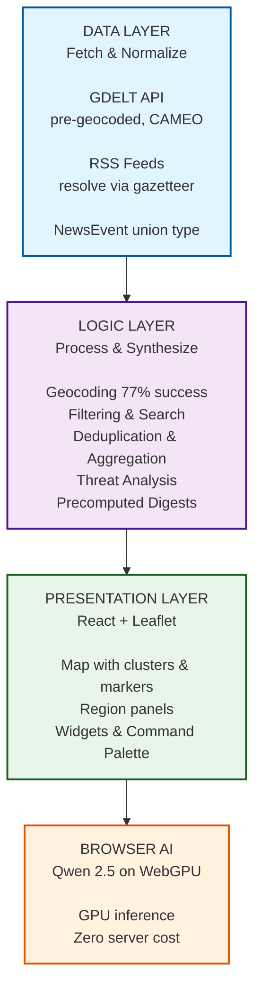
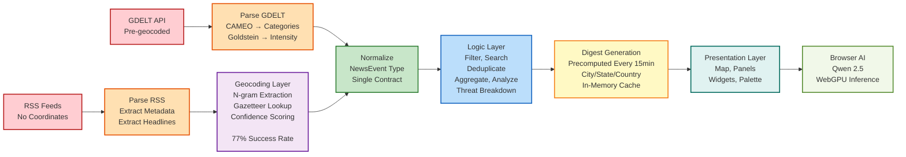
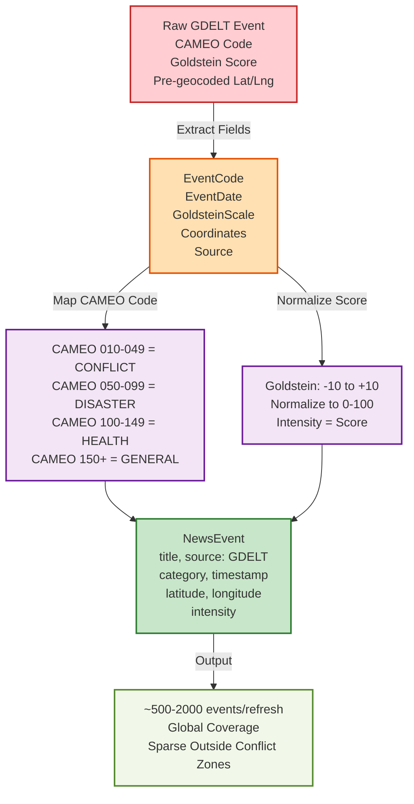
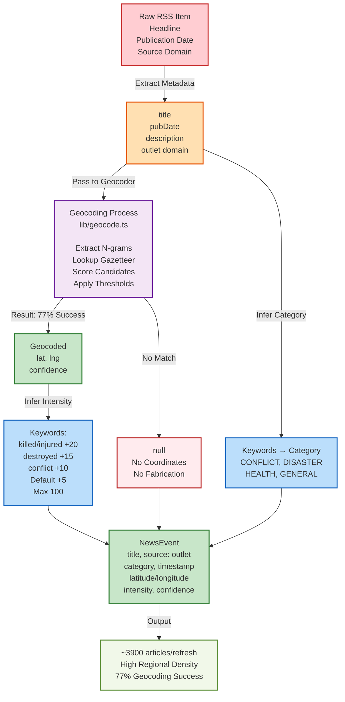

# AakashSanchar Architecture & Core Logic

Detailed documentation of system design, core algorithms, mathematical models, and data flow.

---

## Table of Contents

1. [System Overview](#system-overview)
2. [Data Pipeline](#data-pipeline)
3. [Core Algorithms](#core-algorithms)
4. [Mathematical Models](#mathematical-models)
5. [Performance & Optimization](#performance--optimization)

---

## System Overview

AakashSanchar ingests news from two sources (GDELT + RSS), resolves locations via geocoding, aggregates events with stratified quotas, and precomputes regional analysis — all without database or cron jobs.

### Architecture Layers



---

## Data Pipeline

### Complete Data Flow Diagram



### Source 1: GDELT API

GDELT provides machine-coded events with location data already resolved.

**Input**: Raw GDELT event feed (updated every 15 minutes)

**Processing Flow**:



**Output**: ~500–2,000 events/refresh (global coverage, sparse outside conflict zones)

### Source 2: RSS Feeds

RSS feeds provide regional coverage but have no coordinates.

**Input**: Regional RSS feeds (India, South Asia, global news sites)

**Processing Flow**:



**Output**: ~3,900 articles/refresh (high regional density, 77% geocoding success)

---

## Core Algorithms

### Algorithm 1: Geocoding (Headline → Coordinates)

**Problem**: RSS headline has no location data; extract from free text.

**Solution**: N-gram matching against gazetteer + multi-factor scoring.

#### Process

```
Input:  "Monsoon floods devastate Arunachal Pradesh, 23 reported missing"
        gazetteer = [
          {name: "Arunachal Pradesh", lat: 29.0, lng: 93.5, type: "state", pop: 1.4M},
          {name: "Pradesh", lat: null, type: "partial", ...},
          {name: "Assam", lat: 26.2, lng: 92.9, type: "state", pop: 31M},
          ...
        ]

Step 1: Extract n-grams (1-3 words)
  unigrams:   ["Monsoon", "floods", "devastate", "Arunachal", "Pradesh", ...]
  bigrams:    ["Monsoon floods", "floods devastate", "devastate Arunachal", ...]
  trigrams:   ["Monsoon floods devastate", "floods devastate Arunachal", ...]

Step 2: Lookup each n-gram in gazetteer
  "Arunachal Pradesh" → MATCH (exact, capitalized)
  "Assam" → MATCH (corroborating state)
  "Monsoon" → no match (not a place)

Step 3: Score each candidate
  Score(candidate) = base_score + bonuses

where:
  base_score = normalize(population, 0, 100M) → [0, 40]
               or fixed score by type (country=30, state=35, city=25)

  BONUSES:
    + multi_word_bonus(15) if matched as single concept (e.g., "Arunachal Pradesh")
    + capitalization_bonus(10) if name capitalized in text
    + corroboration_bonus(20) for each other place in headline matching region
    + country_bias_bonus(5) if outlet country ≈ candidate country
    + population_bonus(10) if population > 1M

  For "Arunachal Pradesh" (state, pop 1.4M):
    score = 35 + 15(multi-word) + 10(caps) + 20(Assam corroborates state category)
          = 80

  For "Assam" (state, pop 31M):
    score = 35 + 0(single word) + 10(caps) + 0(not mentioned again)
          = 45

Step 4: Apply confidence thresholds
  if score >= 75 and type in ["state", "country"]:
    confidence = "HIGH"
  elif score >= 60 and type in ["city", "state"]:
    confidence = "MEDIUM"
  elif score >= 45:
    confidence = "LOW"
  else:
    confidence = "NONE" → return null

Step 5: Return top match above threshold
  → { lat: 29.0, lng: 93.5, place: "Arunachal Pradesh", confidence: "HIGH" }

Output: NewsEvent.latitude = 29.0, NewsEvent.longitude = 93.5
```

#### Confidence Thresholds

| Match Type | Min Score | Return Coordinates? |
|------------|-----------|---------------------|
| Multi-word state/country (e.g., "Arunachal Pradesh") | 75 | YES |
| Single-word state/country (e.g., "Maharashtra") | 65 | YES |
| City + strong corroboration | 70 | YES |
| City without corroboration | 55 | YES |
| Below threshold | <45 | NULL (honest, no fabrication) |

**Gazetteer Source**: GeoNames cities15000 (34,000 settlements + state/country boundaries, ~3MB)

**Success Rate**: 77% of RSS articles geocode; 23% return null (by design, never invent).

---

### Algorithm 2: Stratified Marker Quota

**Problem**: ~3,900 articles, map shows max ~822 markers (performance + UX).

**Solution**: Stratified quota ensuring every region gets baseline markers, newest events prioritized.

#### Quota Formula

```
for each region R in [all Indian states/UTs + neighboring countries]:

  if R is Indian state/UT:
    marker_limit[R] = 8
  elif R is neighboring country:
    marker_limit[R] = 8
  else:
    marker_limit[R] = 1

  candidates[R] = filter(all_articles, lat/lng in R.bounds)
  candidates[R].sort_by(pubDate DESC)  # newest first
  
  selected[R] = candidates[R][:marker_limit[R]]
  
  # Apply deterministic jitter for RSS (prevents coincident markers)
  for article in selected[R]:
    if article.source == "RSS":
      jitter_seed = hash(article.id)
      lat += random(jitter_seed, -250m, +250m)
      lng += random(jitter_seed, -250m, +250m)

return selected[all regions]
```

#### Why This Works

**Problem with "Newest N globally"**: Starves low-coverage regions.
- Delhi + Mumbai alone produce 600+ articles/refresh
- Gujarat, Rajasthan, NE states get 0 markers
- User sees only metro areas, misses regional risks

**Problem with uncapped markers**: Creates unusable clusters.
- Mumbai metro stack: 300+ markers
- Zoom to 1,000m scale: still 50+ markers
- Map performance + readability collapse

**Stratified solution**:
- Every state/UT guaranteed 8 markers (newest)
- Every neighbor guaranteed 8 markers
- Total: ~822 markers across 252 regions
- Performance: O(n log n) sort per region, < 100ms total
- Fair coverage: Lagos, Lahore, Dhaka, Kolkata all visible

---

### Algorithm 3: Region Analysis & Threat Assessment

**Problem**: Given articles for a region, characterize risk.

**Solution**: Aggregate keywords + event frequency → threat level.

#### Threat Scoring

```
articles = [
  {title: "Floods displace 10,000", category: "DISASTER"},
  {title: "Militant attack kills 5", category: "CONFLICT"},
  {title: "Cholera outbreak suspected", category: "HEALTH"},
  ...
]

threat_score = 0

for article in articles:
  base = {
    CONFLICT:  +30,
    DISASTER:  +25,
    HEALTH:    +20,
    GENERAL:   +5
  }[article.category]
  
  keywords = {
    "killed", "wounded", "dead": +15,
    "destroyed", "collapse": +10,
    "outbreak", "epidemic": +20,
    "displaced": +8,
  }
  
  keyword_bonus = sum(bonus for keyword in article.title if keyword found)
  
  article_score = base + keyword_bonus
  threat_score += article_score

total_threat = threat_score / len(articles)  # average per article

threat_level = {
  total_threat >= 50: "CRITICAL",
  total_threat >= 35: "HIGH",
  total_threat >= 20: "MEDIUM",
  total_threat >= 5:  "LOW",
  else:               "NONE"
}
```

#### Activity Level

```
activity_level = {
  len(articles) >= 10:  "CRITICAL",
  len(articles) >= 5:   "HIGH",
  len(articles) >= 3:   "MEDIUM",
  len(articles) >= 1:   "LOW",
}
```

---

## Mathematical Models

### Intensity Normalization (GDELT)

Goldstein Scale ranges [-10, +10]; normalize to [0, 100] for marker size.

```
formula:
  intensity = ((goldstein_score - (-10)) / (10 - (-10))) * 100
            = (goldstein_score + 10) / 20 * 100

examples:
  goldstein = -10 (de-escalation)  → intensity = 0
  goldstein =   0 (neutral)        → intensity = 50
  goldstein =  +8 (high severity)  → intensity = 90
  goldstein = +10 (maximum)        → intensity = 100
```

### Population-Based Confidence Boost

Larger cities have better data quality; boost confidence:

```
population_confidence_boost = 
  if population > 10M:        +25 points
  elif population > 1M:       +20 points
  elif population > 100K:     +15 points
  elif population > 10K:      +5 points
  else:                       +0 points
```

### Jitter Calculation (RSS)

Prevent coincident markers from rendering at same point; apply deterministic offset.

```
seed = hash(article_id) mod 2π
lat_offset = cos(seed) * 250m_in_degrees   # ~0.002°
lng_offset = sin(seed) * 250m_in_degrees

new_lat = original_lat + lat_offset
new_lng = original_lng + lng_offset

# Deterministic: same article always gets same offset
# Uniformly distributed: markers spread in circle of radius 250m
```

---

## Performance & Optimization

### Caching Strategy

**Problem**: Every refresh, recompute digests for 377 regions.

**Solution**: In-memory cache, precompute on RSS refresh.

```
On 15-minute RSS refresh:
  (no cron job)

  for each region:
    articles = filter_to_region(all_articles)
    digest = {
      situationBrief: composeSummary(articles),  # O(n) text extraction
      analysis: composeAnalysis(articles),        # O(n) threat scoring
      threatlevel: calculate_threat(articles)
    }
    cache[region] = digest  # ~1 digest every 2.4 seconds

  Total: ~150ms for 377 regions (extractive, no LLM)

On user click (RegionWindow):
  region_digest = cache[region]  # O(1) lookup
  
  if cache miss (cold lambda):
    recompute_on_demand()  # 200ms, then cache
  else:
    instant render (< 10ms)

Storage:
  - ~3,900 articles: ~20MB (in Next.js memory)
  - ~377 digests: ~2MB (text summaries)
  - Total: < 30MB per instance (Vercel free tier: 512MB limit)
```

### Client-Side Rendering Optimization

**Problem**: 822 markers + clustering = potential jank on older devices.

**Solution**: Memoization + clustering + lazy rendering.

```
Optimizations applied:

1. Marker Clustering (leaflet.markercluster)
   - 822 markers → ~150 clusters at zoom 4
   - Expand on zoom
   - O(1) pan/zoom after initial cluster

2. Memoized Components (React.memo)
   - HotspotCard, RegionWindow, etc.
   - Rerender only on prop change
   - Prevents parent re-renders cascading

3. Virtualized Lists
   - Wire view: render only visible articles
   - ~10K articles but show ~20 in viewport

4. URL-Based State
   - Map bounds, zoom, selected region in URL
   - No Redux/context; single source of truth
   - Shareable, persistent across page reload
```

### Bandwidth Optimization

**Problem**: 3MB gazetteer + 20MB articles = slow initial load.

**Solution**: Server-side only, never ship to browser.

```
Gazetteer (data/gazetteer.json):
  - Built during pnpm gazetteer (dev only)
  - Loaded in Node.js only (app/api/gdelt/articles/route.ts)
  - NEVER serialized to client
  - Verified: grep "gazetteer" in generated client chunks → empty

Articles:
  - Fetched via /api/gdelt/articles (cached in Next.js)
  - Returned as JSON (20MB uncompressed, ~2MB gzipped)
  - Gzip compression automatic on Vercel
  - Client receives only ~822 visible markers + ~3,900 wire articles
```

---

## References & Further Reading

- [Data Layer: See app/api/README.md](./app/api/README.md)
- [Logic Layer: See lib/README.md](./lib/README.md)
- [Type System: See types/README.md](./types/README.md)
