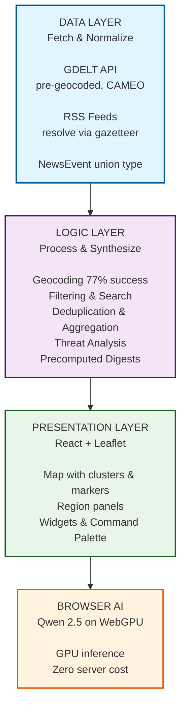

# AakashSanchar

**A Real-Time Global News Intelligence Dashboard with AI-Powered Regional Analysis**

> *News happens everywhere, all the time. AakashSanchar brings live news from across the globe, works out WHERE each story is happening, and plots it on an interactive map with AI-driven insights — all running in your browser.*

---

## Project Overview

### Watch the Demo

<div align="center">

**AakashSanchar: Real-Time Global News Intelligence Dashboard**

A Technical Deep Dive on an IIT-based Summer Internship Project

[](https://www.youtube.com/watch?v=pu-KLG_c1PQ)

**Click above to watch the 8-minute technical deep dive**

</div>

---

### Key Highlights from Video

- Real-time event mapping from GDELT + RSS feeds
- Keyboard-driven command palette for region search (Ctrl+K)
- Browser-side AI analysis (Qwen 2.5 on WebGPU)
- Live threat assessment and activity tracking
- Precomputed regional briefings with zero per-click cost
- Intelligent geocoding with 77% success rate
- Stratified marker quota ensuring balanced coverage
- Complete architecture walkthrough

---

## Key Features

- **Live Global Event Map** — Every glowing dot is a real news event, colored by category (conflict, disaster, health, space) and sized by intensity
- **Intelligent Geocoding** — Headlines with no coordinates are resolved against a 34,000-city gazetteer (GeoNames), with fallback to null (never fabricate)
- **Keyboard-First Interface** — Press `Ctrl+K` to search regions, `Esc` to close — no mouse required
- **Browser-Native AI** — Qwen 2.5 LLM runs entirely on WebGPU; zero server cost, zero API keys
- **Regional Briefings** — AI-generated summaries, timelines, threat breakdowns, and activity levels (LOW to CRITICAL)
- **Multi-Modal Data** — Command center-style ticker, reading-mode Wire view, draggable widgets (stocks, streams, outbreak tracker)
- **Shareable State** — Map view encoded in URL; any perspective is a single link
- **Light & Dark Themes** — Full theme support + region-specific RSS feeds (South Asia multi-language)

---

## Architecture

### System Architecture Layers



### Core Components

| Layer | Files | Purpose |
|-------|-------|---------|
| **Data** | `app/api/gdelt/*`, `app/api/translate/*` | Fetch and parse GDELT + RSS; normalize to NewsEvent |
| **Geocoding** | `lib/geocode.ts`, `data/gazetteer.json` | Resolve headlines to coordinates (77% success) |
| **Logic** | `lib/*.ts` (filter, search, digest, analysis) | Aggregate, filter, and synthesize events per region |
| **Presentation** | `components/*.tsx` | Map, panels, widgets, command palette |
| **AI** | `lib/webLLM.ts` | Browser-native LLM inference on WebGPU |

---

## Core Logic & Algorithms

See [ARCHITECTURE.md](./ARCHITECTURE.md) for comprehensive documentation including:

- Full system data flow & architecture diagrams
- Geocoding algorithm with n-gram matching & confidence scoring (77% success)
- Stratified marker quota strategy (8 per state/UT, 822 total)
- Intensity scoring & Goldstein normalization formulas
- Region digest precomputation & caching (zero per-click cost)
- Mathematical models & performance analysis

---

## Tech Stack

| Component | Technology |
|-----------|------------|
| **Runtime** | Node.js 20+ |
| **Framework** | Next.js 16 + React 19 |
| **Language** | TypeScript 5.7 |
| **Styling** | Tailwind CSS 4.3 |
| **Map** | Leaflet 1.9 + react-leaflet 5.0 + MarkerCluster |
| **Data Fetch** | Next.js API routes (Node.js fetch) |
| **Browser AI** | Qwen 2.5 via @mlc-ai/web-llm + WebGPU |
| **Testing** | tsx assert (5 test suites) |
| **Linting** | Biomejs 2.2 |
| **Deployment** | Vercel (free tier, 5 dynamic routes) |

---

## Installation & Setup

### Prerequisites
- Node.js 20+ (or use nvm)
- pnpm (or npm/yarn)

### Clone & Install

```bash
git clone https://github.com/jyotirmoy-das/aakashsanchar.git
cd heatmap

pnpm install
```

### Build the Gazetteer (One-Time)

```bash
# Downloads GeoNames cities15000, builds data/gazetteer.json (~3MB)
pnpm gazetteer
```

### Run Locally

```bash
pnpm dev
# Opens http://localhost:3000
```

### Run Tests

```bash
pnpm test
# Runs: geocoding, region aggregation, analysis, digest, search
```

### Build & Deploy

```bash
pnpm build
pnpm start  # Local production build

# Or deploy to Vercel (1-click):
vercel
```

---

## Usage Guide

### Map & Markers
- **Pan/Zoom** — Mouse drag or scroll wheel
- **Hover** — Preview headline on marker
- **Click** — Open HotspotCard with headline, source, time, link

### Command Palette
- **Ctrl+K** (or Cmd+K) — Open search
- Type region name (fuzzy + NLP matching)
- **Enter** — Jump map to region, open RegionWindow

### RegionWindow
- **Situation Brief** — AI-extracted summary of recent events
- **Timeline** — Chronological events with risk flags
- **Analysis** — Threat breakdown (LOW / MEDIUM / HIGH / CRITICAL)
- **Esc** — Close panel

### Left Rail Widgets
- **Breaking Ticker** — Live RSS headlines (command-center style)
- **Wire** — Article list view
- **Stocks** — Market data (placeholder)
- **Streams** — Video livestreams (if available)
- **Cameras** — Webcam feeds (if available)
- **Outbreaks** — Health event tracker

### Settings
- **Light/Dark Theme** — Toggle in Settings
- **South Asia Region** — Add regional-language RSS feeds
- **URL Sharing** — Map state encoded in URL; any view is shareable

---

## Known Limitations & Future Work

### Known Limitations
- **Geocoding**: 77% of RSS articles resolve to coordinates; 23% return null (by design)
- **Regional Coverage**: 4 Indian regions (Goa, Andaman & Nicobar, Dadra & Nagar Haveli, Lakshadweep) have no dedicated RSS feed; appear only via national coverage
- **Marker Movement**: HotspotCard `{x,y}` captured at click time; does not recompute on map zoom/pan
- **Antimeridian**: No special handling for date-line wrapping (Fiji, Russia, NZ bboxes may span the globe)
- **Prose Quality**: Digests are extractive (high fidelity, lower fluency); could add Claude API for fluent prose (cost trade-off)

### Roadmap
- [ ] Historical playback with timeline slider
- [ ] Saved regions and custom alerts
- [ ] Per-account locks for concurrent writes (currently global mutex)
- [ ] Gazetteer switch to cities5000 for better coverage of small settlements
- [ ] Server-side alerting (email/Slack on new events in watched regions)
- [ ] Multi-language UI (currently English + South Asia regional RSS)

---

## Testing

**[DETAILED TEST DOCUMENTATION: See `lib/README.md`](./lib/README.md)**

Five test suites validate core logic:

```bash
pnpm test

# Runs:
# ✓ lib/geocode.test.ts       (n-gram resolution, confidence scoring)
# ✓ lib/regionAggregate.test.ts (marker quota per region)
# ✓ lib/regionAnalysis.test.ts (threat breakdown, activity levels)
# ✓ lib/locationDigest.test.ts (precomputed digest format)
# ✓ lib/search.test.ts         (fuzzy matching, NLP)
```

**Browser Verification**: Open `DevTools > Console` to watch live data flow and cache hits.

---

## Deployment

### Vercel (Recommended)

```bash
vercel login
vercel deploy
```

**Why Vercel?**
- 5 dynamic API routes supported (GDELT, RSS, translate)
- 3MB gazetteer stays server-side (not shipped to browser)
- Serverless functions re-run on each request (cold cache OK, re-derives digests)
- Free tier sufficient for ~1,000 concurrent users

### GitHub Pages
⚠️ **Not supported** — requires server-side API routes. Gazetteer (3MB) must never reach browser.

---

## Code Organization

Detailed documentation for each layer:

- [Data Layer Documentation](./app/api/README.md) - API routes, GDELT parsing, RSS feeds
- [Logic Layer Documentation](./lib/README.md) - Geocoding, filtering, analysis, digests
- [Presentation Layer Documentation](./components/README.md) - UI components, state management
- [Type System Documentation](./types/README.md) - Type contracts and schemas

Quick code tour:

**Entry Point**: `app/page.tsx` — Orchestrator. Fetches GDELT + RSS, merges, deduplicates, applies quota.

**Data Layer**: Fetch and normalize GDELT + RSS into a unified NewsEvent type.

**Logic Layer**: Geocode, filter, search, and aggregate events with stratified quota and precomputed digests.

**Presentation Layer**: React components rendering the map, panels, and interactive widgets.

**Browser AI**: Qwen 2.5 inference on WebGPU (no server round trip).

---

## Academic Context

**Mentors**: Mohd. Amaan & Ashwin Jacob Gigo

**Faculty Advisor**: Prof. Prithwijit Guha

---

## License

MIT

---

## Contributing

Bug reports, feature requests, and PRs welcome. Please:
1. Fork the repo
2. Create a feature branch (`git checkout -b feature/my-feature`)
3. Commit with clear messages
4. Push and open a PR

For major changes, open an issue first to discuss.

---

## Documentation Index

Navigate to detailed documentation for each system layer:

| Document | Focus | Contains |
|----------|-------|----------|
| [ARCHITECTURE.md](./ARCHITECTURE.md) | System design & algorithms | Data flow, geocoding algorithm, stratified quota, mathematical models, performance optimization |
| [app/api/README.md](./app/api/README.md) | Data layer | GDELT & RSS fetching, gazetteer structure, geocoding workflow, caching, error handling |
| [lib/README.md](./lib/README.md) | Logic layer | Geocoding details, filtering, search, deduplication, aggregation, analysis, digests, browser AI, testing |
| [components/README.md](./components/README.md) | Presentation layer | Component hierarchy, state management, URL encoding, map rendering, styling, performance optimizations |
| [types/README.md](./types/README.md) | Type system | Type contracts (NewsEvent, Region, RegionDigest, etc.), validation helpers, type safety patterns |

---

## References

- **GDELT Project** — https://gdeltproject.org/
- **GeoNames Gazetteer** — https://www.geonames.org/
- **Leaflet.js** — https://leafletjs.com/
- **Qwen via WebLLM** — https://github.com/mlc-ai/web-llm
- **Next.js Docs** — https://nextjs.org/docs
- **WebGPU** — https://developer.mozilla.org/en-US/docs/Web/API/WebGPU_API

---

**Built by Jyotirmoy Das****

*Last updated: September 2026*
