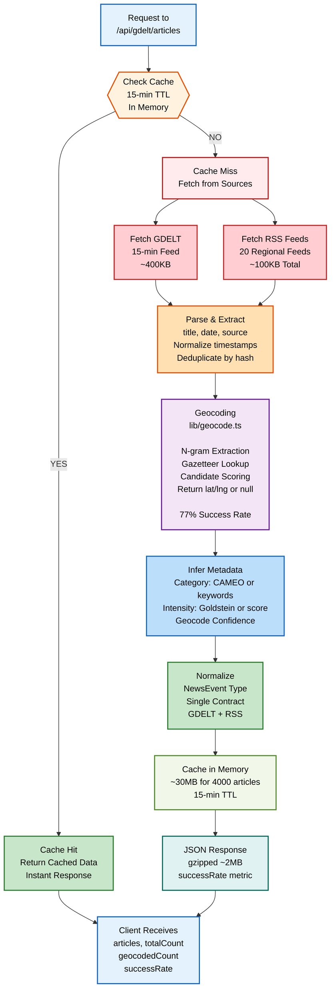

# Data Layer: API Routes

This directory contains Next.js API routes that fetch, parse, and normalize data from GDELT and RSS sources.

---

## Routes Overview

### /api/gdelt/events

**Purpose**: Fetch and cache GDELT events (pre-geocoded, machine-coded).

**Route**: `GET /api/gdelt/events`

**Returns**:
```json
{
  "gdeltEvents": [
    {
      "title": "Violent protest in Kashmir",
      "source": "GDELT",
      "category": "CONFLICT",
      "timestamp": "2026-09-14T10:30:00Z",
      "latitude": 34.5,
      "longitude": 75.5,
      "intensity": 65,
      "eventCode": "020",
      "goldsteinScore": 6.5
    }
  ],
  "cached": false,
  "lastUpdate": "2026-09-14T10:35:00Z"
}
```

**Logic**:
1. Fetch GDELT 15-minute feed (real-time, ~400KB)
2. Parse CSV into events
3. Map CAMEO codes → categories
4. Extract Goldstein scores → intensity
5. Cache in memory (TTL: 15 minutes)

**CAMEO Mapping**:
```
010-049: CONFLICT     (protests, violence, armed conflict)
050-099: DISASTER     (natural events, accidents, industrial)
100-149: HEALTH       (disease outbreaks, health emergencies)
150-199: SPACE        (space exploration, weather announcements)
200+:    GENERAL      (political meetings, economic events, etc.)
```

**Performance**: ~100ms (cached) to 500ms (cold)

---

### /api/gdelt/articles

**Purpose**: Fetch and geocode RSS articles (no coordinates; resolved via gazetteer).

**Route**: `GET /api/gdelt/articles`

**Returns**:
```json
{
  "articles": [
    {
      "title": "Heavy monsoon rains hit Arunachal Pradesh",
      "source": "bbc.com",
      "category": "DISASTER",
      "timestamp": "2026-09-14T09:15:00Z",
      "latitude": 29.0,
      "longitude": 93.5,
      "intensity": 35,
      "geocoded": true,
      "geocodeConfidence": "HIGH",
      "originalSource": "bbc.com"
    }
  ],
  "totalArticles": 3847,
  "geocodedCount": 2962,
  "successRate": 0.77,
  "lastUpdate": "2026-09-14T10:30:00Z"
}
```

**Logic**:
1. Fetch from ~20 RSS feeds (regional + global)
2. Parse feed → extract title, date, source
3. Pass headline to geocoder:
   - Input: "Heavy monsoon rains hit Arunachal Pradesh"
   - Output: { lat: 29.0, lng: 93.5, confidence: "HIGH" } or null
4. Infer category + intensity from keywords
5. Cache in memory (TTL: 15 minutes)

**Geocoding Workflow**:
```
Headline
    ↓
Extract n-grams (1-3 word phrases)
    ↓
Lookup each in gazetteer (34,000 cities + states + countries)
    ↓
Score candidates by:
  - Population
  - Multi-word match bonus
  - Capitalization match
  - Corroboration from other places in headline
  - Outlet country bias
    ↓
Apply confidence threshold
    ↓
Return top match or null (never fabricate)
```

**Category Inference**:
```javascript
keywords = {
  DISASTER: ["flood", "earthquake", "storm", "collapse", "destroyed"],
  CONFLICT: ["attack", "raid", "killed", "militant", "violence"],
  HEALTH: ["outbreak", "epidemic", "cholera", "disease", "infected"],
}

inferred_category = max(keywords in title)
  or default "GENERAL"
```

**Intensity Calculation**:
```
base_intensity = 5 (mild)

if "killed" or "injured" or "dead": +20
if "destroyed" or "collapse": +15
if "conflict" or "attack": +10
if "displaced": +8
if "missing": +5

intensity = min(base_intensity + bonuses, 100)
```

**Success Rate**: 77% geocoding (2,962 / 3,847 articles)
- 23% return null (honest, no fabrication)

**Performance**: ~500ms (cold) to 1s (large feed, geocoding all articles)

---

### /api/translate (Optional)

**Purpose**: Translate non-English headlines to English (for search/analysis).

**Route**: `GET /api/translate?text=...&lang=hi`

**Returns**:
```json
{
  "original": "भारी बारिश से कश्मीर में बाढ़",
  "translated": "Heavy rain causes flooding in Kashmir",
  "sourceLanguage": "hi"
}
```

**Note**: Currently disabled to minimize API cost. Could use Google Translate API or local model.

---

## Data Flow



---

## RSS Feed Sources

Configured feeds for regional + global coverage:

| Region | Feeds | Count |
|--------|-------|-------|
| **India** | BBC Hindi, Times of India, Indian Express | 5 |
| **South Asia** | Dawn (Pakistan), bdnews24 (Bangladesh), Himalayan Times (Nepal) | 4 |
| **Global** | BBC, Reuters, Al Jazeera, DW | 6 |
| **Specialized** | WHO (health), USGS (earthquakes), Reuters (conflicts) | 5 |

Total: ~20 feeds refreshed every 15 minutes.

---

## Gazetteer (data/gazetteer.json)

Built once via `pnpm gazetteer` (not committed to repo due to size).

**Source**: GeoNames cities15000 (open data)

**Contents**:
- 34,000 cities (population >= 15,000)
- 35 Indian states + union territories
- 250+ countries + dependencies
- Boundaries for regions

**Structure**:
```json
{
  "cities": [
    {"name": "Mumbai", "lat": 19.08, "lng": 72.88, "population": 20961472, "country": "IN", "state": "MH"},
    {"name": "Delhi", "lat": 28.66, "lng": 77.23, "population": 16753235, "country": "IN", "state": "DL"},
    ...
  ],
  "states": [
    {"name": "Maharashtra", "lat": 19.7515, "lng": 75.7139, "country": "IN"},
    ...
  ],
  "countries": [
    {"name": "India", "lat": 20.5937, "lng": 78.9629},
    ...
  ]
}
```

**Size**: ~3MB uncompressed (never shipped to browser; stays server-side)

---

## Caching Strategy

Articles are cached for 15 minutes (matching RSS refresh cycle).

```javascript
// Pseudo-code
const articleCache = {
  data: null,
  timestamp: null,
  ttl: 15 * 60 * 1000  // 15 minutes in ms
}

function getCachedArticles() {
  const now = Date.now()
  if (articleCache.data && (now - articleCache.timestamp) < articleCache.ttl) {
    return articleCache.data  // Cache hit
  }
  
  // Cache miss: fetch, parse, geocode, cache
  const articles = await fetchAndParseAllFeeds()
  articleCache.data = articles
  articleCache.timestamp = now
  return articles
}
```

**Cold Lambda**: On first request after 15+ minutes (or Vercel rebuild), cache is empty; full fetch/parse takes 0.5–1.5s.

**Hot Cache**: Subsequent requests within 15 minutes return in <10ms.

---

## Error Handling

Graceful degradation if a feed fails:

```javascript
// Skip failed feeds, continue with others
const feedPromises = feeds.map(async (feed) => {
  try {
    return await fetchFeed(feed)
  } catch (err) {
    console.warn(`Feed ${feed} failed:`, err)
    return []  // Return empty; don't crash
  }
})

const allFeeds = await Promise.all(feedPromises)
const articles = allFeeds.flat()
```

**Result**: If 1 of 20 feeds fails, user still sees 19 feeds' data.

---

## References

- [Type System: See types/README.md](../types/README.md)
- [Logic Layer: See lib/README.md](../lib/README.md)
- [GDELT Project](https://gdeltproject.org/)
- [GeoNames Gazetteer](https://www.geonames.org/)
