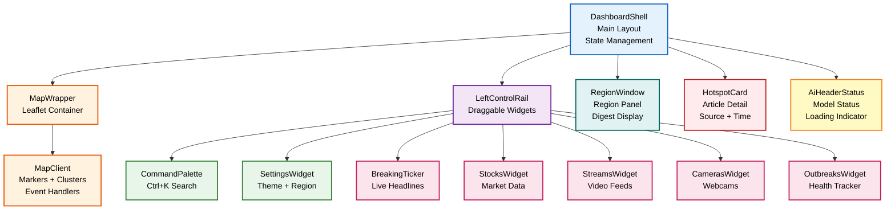

# Presentation Layer: UI Components & State Management

This directory contains React components for rendering the map, panels, widgets, and interactive controls.

---

## Component Hierarchy



---

## Core Components

### DashboardShell

Main layout orchestrator. Manages:
- Window state (selected region, open panels)
- Event filtering (category, time, region)
- Widget visibility
- Theme (light/dark)

**Key Logic**:
```typescript
const DashboardShell = () => {
  const [selectedRegion, setSelectedRegion] = useState(null)
  const [openWidgets, setOpenWidgets] = useState({})
  const [filters, setFilters] = useState({ categories: [], ...})
  
  return (
    <div className="dashboard">
      <MapWrapper 
        articles={filteredArticles} 
        onMarkerClick={setSelectedRegion}
      />
      <LeftControlRail 
        openWidgets={openWidgets}
        onToggleWidget={(widget) => ...}
      />
      {selectedRegion && <RegionWindow region={selectedRegion} />}
      {hoveredArticle && <HotspotCard article={hoveredArticle} />}
    </div>
  )
}
```

**State Management**: Uses `useUrlState()` hook to encode all state in URL
- Shareable links: any map view is one URL
- Persistent across page reload
- No Redux/context needed

---

### MapWrapper & MapClient

Leaflet map container and interactive event handler.

**MapWrapper**: Container, tile provider setup
**MapClient**: Markers, clusters, interactions

### Marker Rendering Logic

```typescript
// ClusterMarkers (via leaflet.markercluster)
articles.forEach(article => {
  if (!article.latitude || !article.longitude) return  // skip nulls
  
  const marker = L.circleMarker([article.latitude, article.longitude], {
    radius: mapIntensity(article.intensity),  // size by intensity
    color: categoryColor(article.category),   // color by category
    fillOpacity: 0.7,
    weight: 2
  })
  
  marker.bindPopup(`${article.title} (${article.source})`)
  marker.on('click', () => {
    showHotspotCard(article)
    setSelectedRegion(regionForCoordinates(article.lat, article.lng))
  })
  
  clusterGroup.addLayer(marker)
})
```

### Cluster Expansion

- Zoom level < 6: Show clusters (count of articles)
- Zoom level 6–10: Show clusters + some individual markers
- Zoom level > 10: Show all individual markers

**Performance**: ~822 markers grouped into ~150 clusters at typical zoom

---

### CommandPalette (Ctrl+K Search)

Fuzzy search for regions and articles.

### Architecture

```
User presses Ctrl+K
  ↓
Open modal overlay
  ↓
Show input: "Search regions, articles..."
  ↓
User types: "Nepal"
  ↓
Call search.fuzzySearch("Nepal") (lib/search.ts)
  ↓
Rank results:
  ["Nepal", "Nepalese", "Nepali Army", "Neo-Nepal"]
  ↓
Render suggestions
  ↓
User presses Enter on "Nepal"
  ↓
Map flies to Nepal bounds (setMapBounds)
  ↓
Open RegionWindow for Nepal
  ↓
Close palette (ESC)
```

### Search Ranking

```typescript
interface SearchResult {
  type: "region" | "article"
  name: string
  score: number          // 0–100
  metadata: any
}

// Scoring formula
score = 
  (exactMatch ? 100 : 0) +
  (prefixMatch ? 50 : 0) +
  (fuzzyMatch ? 100 * (1 - levenDist / maxDist) : 0) +
  (wordBoundary ? 20 : 0)

// Sort by score descending
results.sort((a, b) => b.score - a.score)
```

---

### RegionWindow

Shows precomputed digest (Situation Brief + Analysis) for a region.

### Content Structure

```
┌─────────────────────────────────────────┐
│ REGION WINDOW: Kashmir                  │
├─────────────────────────────────────────┤
│ SITUATION BRIEF                         │
│ ─────────────────────────────────────   │
│ 3 articles in last 4 hours              │
│ • Clashes reported near LoC (2h ago)    │
│ • Military movement intensifies (3h)    │
│ • Civilian casualties reported (4h)     │
│                                          │
│ ANALYSIS                                │
│ ─────────────────────────────────────   │
│ Threat Level: HIGH                      │
│ Activity Level: MEDIUM                  │
│ Top Events: CONFLICT (3), GENERAL (1)   │
│                                          │
│ [Close] [Share] [Pin]                   │
└─────────────────────────────────────────┘
```

### Data Source

```typescript
// On mount, fetch precomputed digest
const RegionWindow = ({ region }) => {
  const [digest, setDigest] = useState(null)
  
  useEffect(() => {
    // Lookup: O(1) via lib/locationDigest
    // Already precomputed on server
    // Return from cache in < 1ms
    setDigest(getDigest(region.name))
  }, [region])
  
  return (
    <div>
      <SituationBrief brief={digest.situationBrief} />
      <Analysis analysis={digest.analysis} />
    </div>
  )
}
```

**Why instant?** Digests precomputed every 15 min during RSS refresh; no per-click computation.

---

### HotspotCard

Detail card for a single article.

### Layout

```
┌──────────────────────────────┐
│ HOTSPOT: Flooding in Kashmir │
├──────────────────────────────┤
│                              │
│ Severe monsoon rains trigger │
│ flooding, displacing 500...  │
│                              │
│ Source: BBC News            │
│ Time: 2 hours ago           │
│ Category: DISASTER          │
│ Intensity: 65/100           │
│                              │
│ [Read Full Article]         │
│ [Close]                     │
└──────────────────────────────┘
```

### Screen Coordinates Quirk

HotspotCard captures screen `{x, y}` at click time; positioned absolutely.

**Known limitation**: Does not recompute on map zoom/pan, so card may drift off screen.

**Workaround**: Click new marker to update position; card will re-render.

---

### BreakingTicker & Wire View

Two views of the same article data.

#### BreakingTicker (tab: "News")
- Command center style
- Horizontal scrolling headlines
- Red banner background (urgent)
- Updates every 15 seconds

#### Wire View (tab: "Wire")
- Reading mode
- Vertical list with metadata
- Category badges, timestamps
- Virtualized (only visible articles rendered)

---

### Widgets

Draggable panels in left rail.

| Widget | Data Source | Status |
|--------|-------------|--------|
| Settings | Local state | Complete |
| Stocks | (placeholder) | Stub |
| Streams | (placeholder) | Stub |
| Cameras | (placeholder) | Stub |
| Outbreaks | lib/deriveOutbreaks | Complete |

**Draggable**: Uses Framer Motion for smooth animations

---

## State Management Strategy

### URL-Encoded State

```typescript
// URL: https://aakashsanchar.vercel.app/?
//      zoom=6&
//      lat=28.6&lng=77.2&
//      selectedRegion=Delhi&
//      filters=CONFLICT,DISASTER&
//      theme=dark

// Parsed into React state
const urlState = {
  zoom: 6,
  center: { lat: 28.6, lng: 77.2 },
  selectedRegion: "Delhi",
  filters: ["CONFLICT", "DISASTER"],
  theme: "dark"
}

// On state change, update URL (no page reload)
// On page reload, restore state from URL
```

**Advantages**:
- Shareable links (copy/paste to share a view)
- Browser back/forward work
- No session storage needed
- No Redux boilerplate

**Hook**: `useUrlState()`

```typescript
const useUrlState = () => {
  const [state, setState] = useState(parseUrl(window.location))
  
  useEffect(() => {
    const newUrl = buildUrl(state)
    window.history.replaceState(null, '', newUrl)
  }, [state])
  
  return [state, setState]
}
```

---

## Styling & Theming

### Tailwind CSS

All components use Tailwind classes:
```jsx
<div className="flex flex-col gap-4 p-4 bg-white dark:bg-slate-900">
  <h1 className="text-2xl font-bold text-gray-900 dark:text-white">
    Dashboard
  </h1>
</div>
```

### Dark Mode

Enabled via CSS variable + Tailwind `dark:` modifier:

```html
<html class="dark">
  <head>
    <style>
      :root {
        --background: #fff;
        --foreground: #000;
      }
      html.dark {
        --background: #0a0a0a;
        --foreground: #fafafa;
      }
    </style>
  </head>
</html>
```

### Category Colors

```typescript
const categoryColor = (category) => {
  return {
    CONFLICT: "#dc2626",    // red
    DISASTER: "#ea580c",    // orange
    HEALTH: "#f59e0b",      // amber
    SPACE: "#6366f1",       // indigo
    GENERAL: "#6b7280"      // gray
  }[category]
}

// Usage in markers
<circleMarker
  center={[article.lat, article.lng]}
  color={categoryColor(article.category)}
/>
```

---

## Performance Optimizations

### 1. Memoization

```typescript
const HotspotCard = React.memo(({ article }) => {
  return <div>{article.title}</div>
}, (prev, next) => prev.article.id === next.article.id)
```

Prevents re-render if article prop unchanged.

### 2. Virtualized Lists

Wire view uses react-window:
```typescript
<FixedSizeList
  height={500}
  itemCount={articles.length}
  itemSize={60}
>
  {({ index, style }) => (
    <div style={style}>
      {articles[index].title}
    </div>
  )}
</FixedSizeList>
```

Renders only visible rows (~20 out of 3,900).

### 3. Lazy Loading

RegionWindow content lazy-loads digest on mount:
```typescript
useEffect(() => {
  // Only fetch when region changes
  setDigest(getDigest(region.name))
}, [region.name])
```

### 4. Clustering

Leaflet.markercluster automatically groups markers:
- 822 markers → ~150 clusters at zoom 4
- Progressive disclosure (expand on zoom/click)
- No client-side recompute on pan (cached clusters)

---

## Component Props & Types

See [types/README.md](../types/README.md) for full type definitions.

Quick reference:

```typescript
interface Article {
  title: string
  source: string
  category: "CONFLICT" | "DISASTER" | "HEALTH" | "SPACE" | "GENERAL"
  timestamp: Date
  latitude: number | null
  longitude: number | null
  intensity: number
}

interface RegionDigest {
  situationBrief: {
    headline: string
    recent: string[]
    count: number
  }
  analysis: {
    threatLevel: "LOW" | "MEDIUM" | "HIGH" | "CRITICAL"
    activityLevel: "LOW" | "MEDIUM" | "HIGH" | "CRITICAL"
    topCategories: Array<{ name: string; count: number }>
    timelineEvents: Array<{ time: string; headline: string }>
  }
}
```

---

## References

- [Type System: See types/README.md](../types/README.md)
- [Logic Layer: See lib/README.md](../lib/README.md)
- [Tailwind CSS Documentation](https://tailwindcss.com/)
- [React-Leaflet Documentation](https://react-leaflet.js.org/)
- [Leaflet MarkerCluster](https://github.com/Leaflet/Leaflet.markercluster)
