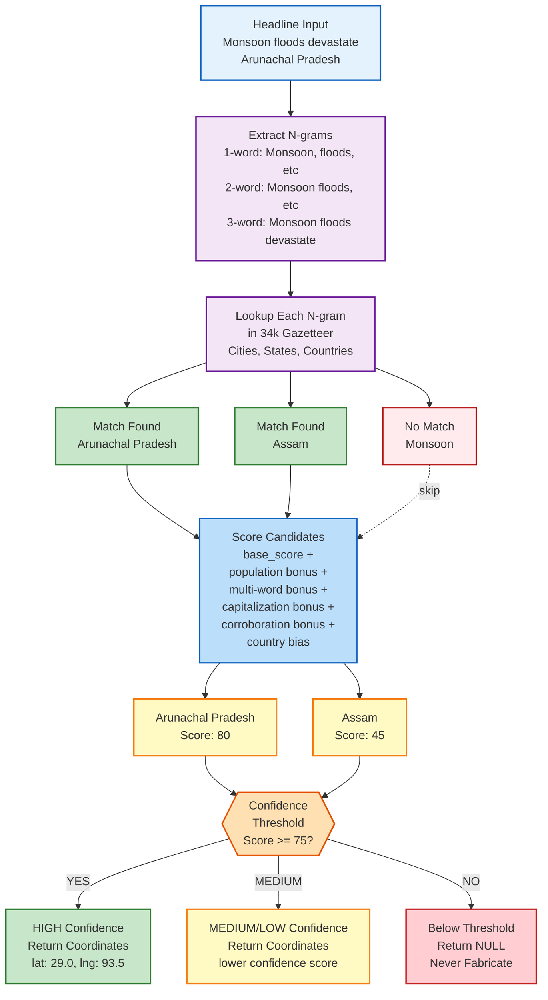
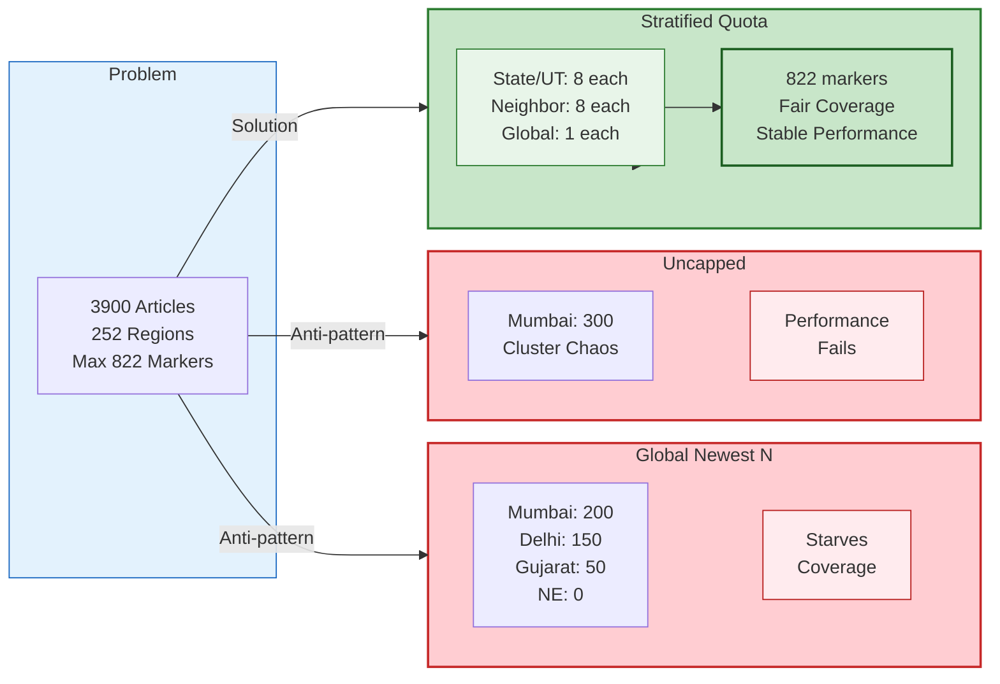

# Logic Layer: Core Algorithms & Processing

This directory contains pure functions for filtering, aggregating, analyzing, and digesting news events.

---

## Module Overview

| File | Purpose |
|------|---------|
| `geocode.ts` | Headline → { lat, lng } via gazetteer n-gram matching |
| `filterEvents.ts` | Apply category, time, bbox, and region filters |
| `search.ts` | Fuzzy + NLP search over regions and events |
| `deriveOutbreaks.ts` | Detect health event clusters → outbreak flags |
| `intelligenceSynthesizer.ts` | Merge GDELT + RSS, deduplicate |
| `regionAggregate.ts` | Apply stratified quota (8 per state/UT) |
| `regionAnalysis.ts` | Compute threat level and activity per region |
| `locationDigest.ts` | Precompute Situation Brief + Analysis per place |
| `webLLM.ts` | Load Qwen 2.5 model and run inference (browser) |
| `tagPalette.ts` | Color mapping for event categories |
| `basemaps.ts` | Map tile provider definitions |
| `regions.ts` | Region (state/country) boundary definitions |

---

## Geocoding (geocode.ts)

Resolves a news headline to geographic coordinates without fabricating locations.

### Algorithm

Input headline: "Monsoon floods devastate Arunachal Pradesh"

Output: `{ lat: 29.0, lng: 93.5, confidence: "HIGH" }` or `null`

### Geocoding Workflow Diagram



### N-gram Extraction

```javascript
function extractNgrams(headline) {
  const words = headline.split(/\s+/)
  const unigrams = words.map(w => [w])           // ["Monsoon"], ["floods"], ...
  const bigrams = zip(words, words.slice(1))     // ["Monsoon", "floods"], ...
  const trigrams = zip(words, words.slice(1), words.slice(2))
  return [...unigrams, ...bigrams, ...trigrams]
}
```

### Confidence Scoring

```
For each n-gram:
  if n_gram matches gazetteer entry:
    
    score = base_score + bonuses
    
    base_score = {
      if type == "country": 30,
      if type == "state": 35,
      if type == "city": 25
    }
    + normalize(population / 100M) * 15  // [0, 15]
    
    bonuses:
      + multi_word_match: 15             // e.g., "Arunachal Pradesh" as one unit
      + capitalization_match: 10         // "Kerala" vs "kerala"
      + corroboration: 20 * num_other_places  // "Assam" + "Nagaland" → state category
      + country_bias: 5                  // outlet country ≈ candidate country
    
    return max(score, 0)
```

### Confidence Thresholds

```
if max_score >= 75:
  confidence = "HIGH"
  return { lat, lng, confidence }

elif max_score >= 60:
  confidence = "MEDIUM"
  return { lat, lng, confidence }

elif max_score >= 45:
  confidence = "LOW"
  return { lat, lng, confidence }

else:
  return null  # Never fabricate!
```

### Examples

```
Headline: "Severe earthquake hits Nepal"
Candidates: Nepal (country, score: 85), Kathmandu (city, score: 60)
Result: { lat: 28.4, lng: 84.1, confidence: "HIGH", place: "Nepal" }

Headline: "Police raid suspected hideout in Kunduz"
Candidates: Kunduz (city in Afghanistan, score: 70)
Result: { lat: 36.9, lng: 68.9, confidence: "HIGH", place: "Kunduz" }

Headline: "Monsoon season begins across Asia"
Candidates: None specific (too vague)
Result: null  (Honest; no centroid fallback)
```

**Success Rate**: 77% of RSS articles geocode; 23% return null.

---

## Filtering (filterEvents.ts)

Apply multiple filters to reduce articles to a subset.

### Filters

```javascript
filterEvents(articles, {
  categories: ["CONFLICT", "DISASTER"],    // Include only these
  startDate: Date,                         // Articles >= this date
  endDate: Date,                           // Articles <= this date
  bbox: { north, south, east, west },      // Geographic bounding box
  region: { name, bounds },                // Specific region
  searchTerm: string                       // Fuzzy search (via search.ts)
})
```

### Example

```javascript
const india = articles.filter(a => 
  a.latitude >= 8 && a.latitude <= 35 &&   // India bbox
  a.longitude >= 68 && a.longitude <= 97
)
// ~60% of global articles fall within India

const disasters = india.filter(a => a.category === "DISASTER")
// ~20% of Indian articles
```

---

## Search (search.ts)

Fuzzy + NLP search over event titles and region names.

### Algorithm

1. **Tokenization**: Split on whitespace + punctuation
2. **Stemming**: Reduce to root form (e.g., "flooding" → "flood")
   - Note: Known quirks (Wales → wale, Beijing → beij)
3. **Fuzzy Matching**: Levenshtein distance <= 2
4. **Scoring**:
   - Exact match: +100
   - Prefix match (e.g., "Kunduz" starts with "Kun"): +50
   - Fuzzy match: 100 * (1 - distance/max_distance)
   - Word boundary match: +20 (not substring)

### Example

```
Search: "Nepal"
Candidates: ["Nepal", "Nepalese", "Neo-Palestinian", "Nepalis"]

Nepal:          exact match → score: 100
Nepalese:       prefix + fuzzy → score: 80
Neo-Palestinian: partial substring → score: 25 (no word boundary)

Result: ["Nepal", "Nepalese", "Nepalis", "Neo-Palestinian"]  (ranked by score)
```

### Known Limitations

- Stemmer edge cases: Wales → wale, Beijing → beij
- Substring matching without word boundaries: "Tehran".includes("Iran") matches

---

## Outbreak Detection (deriveOutbreaks.ts)

Identify clusters of health events indicating potential outbreaks.

### Logic

```javascript
function deriveOutbreaks(articles) {
  const healthArticles = articles.filter(a => a.category === "HEALTH")
  
  for (const region in regions):
    const regionArticles = healthArticles.filter(a => inRegion(a, region))
    
    if regionArticles.length >= 3 in last 7 days:
      outbreaks[region] = {
        name: extract_disease_from_titles(regionArticles),
        count: regionArticles.length,
        severity: "MEDIUM" or "HIGH",
        flagged: true
      }
```

### Example

```
Region: Kerala
Articles (last 7 days):
  1. "Dengue cases surge in Kerala"
  2. "Hospitals overwhelmed with fever patients"
  3. "Health ministry alerts on dengue spread"

Result:
  outbreaks["Kerala"] = {
    name: "Dengue",
    count: 3,
    severity: "MEDIUM",
    flagged: true
  }
```

---

## Deduplication (intelligenceSynthesizer.ts)

Merge GDELT + RSS articles, removing duplicates.

### Strategy

```javascript
function deduplicateArticles(gdelt, rss) {
  const seen = new Map()  // { titleHash → article }
  
  for (const article of [...gdelt, ...rss]):
    const hash = hashTitle(article.title)
    
    if seen.has(hash):
      // Merge metadata (keep both sources, take higher intensity)
      existing = seen.get(hash)
      existing.intensity = Math.max(existing.intensity, article.intensity)
      existing.sources = [...existing.sources, article.source]
    else:
      seen.set(hash, article)
  
  return Array.from(seen.values())
}
```

**Result**: ~3,900 articles → ~2,500–3,200 deduplicated articles.

---

## Region Aggregation (regionAggregate.ts)

Apply stratified quota: newest 8 articles per state/UT, oldest first.

### Strategy Comparison



### Algorithm

```javascript
function aggregateByRegion(articles) {
  const byRegion = {}
  
  for (const region of allRegions):
    byRegion[region.name] = articles
      .filter(a => inRegion(a, region))
      .sort((a, b) => b.timestamp - a.timestamp)  // newest first
      .slice(0, region.markerLimit)  // newest 8 (or 1 for global regions)
    
    // Apply jitter to RSS articles (prevent coincident markers)
    for (const article of byRegion[region.name]):
      if article.source === "RSS":
        [article.latitude, article.longitude] = 
          applyJitter(article.latitude, article.longitude, article.id)
  
  return byRegion
}

function applyJitter(lat, lng, id) {
  const seed = hash(id) % (2 * Math.PI)
  const jitterRadius = 250  // meters
  const jitterLat = jitterRadius / 111000  // ~0.002 degrees
  const jitterLng = jitterRadius / (111000 * Math.cos(lat * Math.PI / 180))
  
  return [
    lat + jitterLat * Math.cos(seed),
    lng + jitterLng * Math.sin(seed)
  ]
}
```

### Marker Limits

```
Indian States/UTs: 8 markers each
Neighboring Countries: 8 markers each
Global Regions: 1 marker each

Total: ~822 markers across 252 regions
```

### Why Jitter?

Multiple RSS articles from the same place geocode to exact same point → marker is inert (doesn't move, hard to see). Jitter scatters them in a 250m radius so user can:
- See there are multiple articles
- Click different markers to read different sources
- Progressive disclosure (click to expand cluster)

---

## Region Analysis (regionAnalysis.ts)

Compute threat level and activity level per region.

### Threat Scoring

```
For each article:
  base_threat = {
    CONFLICT: 30,
    DISASTER: 25,
    HEALTH: 20,
    GENERAL: 5
  }
  
  keyword_bonus = {
    "killed", "dead", "wounded": +15,
    "destroyed", "collapse": +10,
    "outbreak", "epidemic": +20,
    "displaced": +8
  }
  
  article_threat = base_threat + keyword_bonus

region_threat = mean(article_threat for all articles in region)

threat_level = {
  >= 50: "CRITICAL",
  >= 35: "HIGH",
  >= 20: "MEDIUM",
  >= 5: "LOW",
  else: "NONE"
}
```

### Activity Scoring

```
activity_level = {
  articles_in_region >= 10: "CRITICAL",
  articles_in_region >= 5: "HIGH",
  articles_in_region >= 3: "MEDIUM",
  articles_in_region >= 1: "LOW",
  else: "NONE"
}
```

---

## Region Digests (locationDigest.ts)

Precompute Situation Brief + Analysis per city/state/country (no cost on click).

### Digest Structure

```javascript
digest = {
  situationBrief: {
    headline: "Summary line",
    recent: ["Most recent event", "Second most recent", ...],
    count: 5
  },
  
  analysis: {
    threatLevel: "HIGH",
    activityLevel: "MEDIUM",
    topCategories: [
      { name: "CONFLICT", count: 3 },
      { name: "DISASTER", count: 2 }
    ],
    timelineEvents: [
      { time: "2 hours ago", headline: "..." },
      { time: "4 hours ago", headline: "..." }
    ]
  }
}
```

### Precomputation Timing

```
Every 15 minutes (on RSS refresh):
  for each of 377 regions:
    articles = filter_to_region(all_articles)
    digest[region] = {
      situationBrief: compose_summary(articles),  // O(n) extractive
      analysis: compose_analysis(articles)         // O(n) threat scoring
    }

Total time: ~150ms (no LLM, extractive only)

On user click:
  digest = cache[region]  // O(1) lookup
  return digest           // instant render
```

### Prose Generation

**Current**: Extractive (high fidelity, lower fluency)
- Extract headlines in chronological order
- Extract top keywords
- State threat level

**Optional Future**: Call Claude API for fluent prose
- Trade-off: cost ($0.01 per digest) vs fluency
- Mitigate via: cache + change-detection (not re-summarise static places 96×/day)

---

## Browser AI (webLLM.ts)

Load Qwen 2.5 LLM and run inference on WebGPU (no server).

### Initialization

```javascript
// Load model (one-time, ~1.5GB download via WebLLM CDN)
const engine = new MLCEngine()
await engine.reload("Qwen2.5-7b-instruct-q4f32_1")

// First run: ~10 seconds
// Subsequent runs: ~2 seconds per generation
```

### Inference

```javascript
// Example: Generate a brief for Kashmir
const prompt = `
Analyze these news events and provide a threat assessment:
${articles.map(a => a.title).join("\n")}

Respond with:
1. Situation Summary (2 sentences)
2. Threat Level (LOW/MEDIUM/HIGH/CRITICAL)
3. Key concerns
`

const output = await engine.generate(prompt, {
  max_new_tokens: 300,
  temperature: 0.7
})
```

### Architecture

```
WebGPU (if available)
    ↓
Qwen 2.5 (7B) quantized to q4f32 (~2GB VRAM)
    ↓
KV cache on GPU
    ↓
Token generation (10–30 tokens/sec on RTX 3060)
```

### Cost-Benefit

Advantages:
- Zero server cost
- Zero API keys
- Privacy (data never leaves browser)
- On-demand (user pays with GPU time, not $ per API call)
- Scales to millions of users (each user runs on their GPU)

Trade-offs:
- Requires WebGPU (Chrome 120+, Firefox 129+)
- High VRAM (8GB+ recommended)
- Slower than server inference (2s vs 200ms)
- Model can hallucinate (needs verification)

---

## Testing (*.test.ts)

Five test suites validate core logic:

```bash
pnpm test
```

### Run Each Test

```bash
tsx lib/geocode.test.ts           # Geocoding accuracy
tsx lib/regionAggregate.test.ts   # Stratified quota
tsx lib/regionAnalysis.test.ts    # Threat scoring
tsx lib/locationDigest.test.ts    # Digest precomputation
tsx lib/search.test.ts            # Fuzzy search
```

### Test Coverage

| Test | Validates |
|------|-----------|
| `geocode.test.ts` | N-gram extraction, gazetteer lookup, confidence scoring |
| `regionAggregate.test.ts` | Stratified quota (8 per state), jitter distribution |
| `regionAnalysis.test.ts` | Threat level calculation, activity level binning |
| `locationDigest.test.ts` | Digest structure, composition pipeline |
| `search.test.ts` | Fuzzy matching, stemming, region search |

### Example: Geocoding Test

```typescript
const articles = [
  {
    title: "Severe flooding in Arunachal Pradesh",
    expected: { lat: 29.0, lng: 93.5, confidence: "HIGH" }
  },
  {
    title: "Market opens in Paris",
    expected: { lat: 48.8, lng: 2.3, confidence: "HIGH" }
  },
  {
    title: "Global economic trends",
    expected: null  # Too vague, no location
  }
]

for (const test of articles) {
  const result = geocode(test.title)
  assert(result.lat === test.expected.lat, "latitude mismatch")
  assert(result.lng === test.expected.lng, "longitude mismatch")
  assert(result.confidence === test.expected.confidence, "confidence mismatch")
}
```

---

## Performance Notes

| Operation | Time | Cached? |
|-----------|------|---------|
| Geocode one article | 5–20ms | No |
| Geocode 3,900 articles (batch) | 500ms | No |
| Stratified aggregation | 50ms | No |
| Threat analysis (377 regions) | 100ms | No |
| Digest precomputation | 150ms | Yes (15-min cache) |
| Search (500 regions) | 50ms | No |
| Digest lookup (on click) | <1ms | Yes |

**Bottleneck**: Geocoding (500ms for all articles). Mitigated via:
- Gazetteer in memory (fast lookup)
- N-gram indexing (skip non-matches)
- Parallel processing (in theory; Node.js single-threaded in practice)

---

## References

- [ARCHITECTURE.md](../ARCHITECTURE.md) - Full algorithm docs
- [Data Layer: See app/api/README.md](../app/api/README.md)
- [Type System: See types/README.md](../types/README.md)
